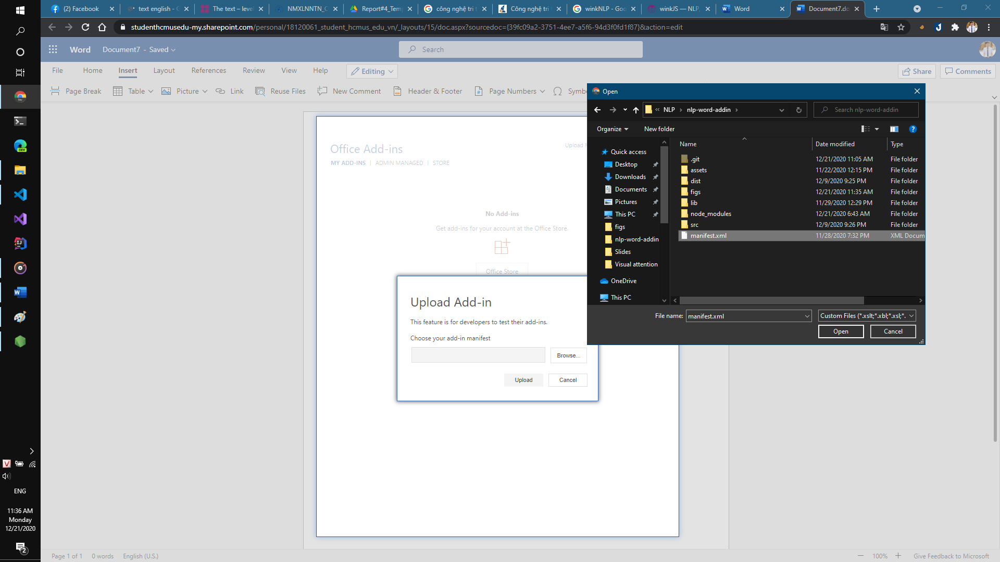

### Trường Đại học Khoa học Tự nhiên
### Khoa Công nghệ Thông Tin
### Bộ môn Công nghệ Tri thức
### Nhập môn xử lý ngôn ngữ tự nhiên

Đồ án lý thuyết cuối kỳ

Đề tài: Xây dựng add-in trên word để tách từ và thống kê văn bản (số từ, tiếng, dấu câu, từ khóa, ...)

Nhóm

1. Đoàn Đăng Khoa (Dang-Khoa Doan) - 18120185
2. Lê Nhựt Nam (Nhut-Nam Le) - 18120061

**Giới thiệu**: Trong lĩnh vực văn phòng, công cụ soạn thảo văn bản là rất cần thiết và phổ biến. Một số phần mềm soạn thảo văn bản hiện nay thông dụng, có thể nói đến là Microsoft Word. Thông tin văn bản (text) chiếm phần lớn lượng trí thức con người, số lượng tập tin (file) văn bản chiếm số lượng rất lớn. Dựa vào một số thao tác tiền đề như chuyển đổi tập tin pdf sang tập tin văn bản (docx, doc, …), nhận diện văn bản và chuyển đổi sang dạng text có thể lưu trữ dưới dạng tập tin văn bản, …

**Mục đích**: Với mục địch rút ra những thông tin từ dữ liệu văn bản Word, giúp người dùng Word tiện phân tích, làm tiền đề cho các bước xử lý kế tiếp. Việc cần một công cụ có thể thực hiện bước tiền xử lý như tách đoạn, tách câu, tách từ và thống kê văn bản là cũng cần thiết.
Dựa trên những dữ liệu thống kê trên, ta có thể áp dụng một số phương pháp cao cấp hơn như kiểm lỗi chính tả, sử dụng các mô hình để rút ra được những thông tin quan trọng từ người dùng, …

**Đầu vào của bài toán (Input)**: Dữ liệu text trong khung gõ chữ trong Microsoft Word

**Đầu ra của bài toán (Output)**: Những thông tin thống kê của dữ liệu text đầu vào
-	Số lượng đoạn, câu, từ
-	Số từ trên mỗi câu, số ký tự trên mỗi từ
-	Số lượng dấu câu được sử dụng
-	Từ khóa (những từ có tần suất xuất hiện nhiều trong text)

**Công cụ/ Framework sử dụng**: Office Add-ins của MS với NodeJS và ngôn ngữ lập trình JavaScript.
winkJS - Developer friendly Natural Language Processing

**Hướng tiếp cận, xử lý**:Sử dụng những kiến thức cơ bản của Xử lý ngôn ngữ tự nhiên để thực hiện thao tác tiền xử lý dữ liệu: tách đoạn, tách câu, tách từ.
Thống kê số đoạn, số câu, số từ, số dấu câu.

**Xử lý trên ngôn ngữ**: Tiếng Anh, Tiếng Việt.

**Ứng dụng thực tế:** 
-	Thống kê các thông số cần thiết, áp dụng vào các mô hình thống kê để đưa ra dự đoán về tần suất sử dụng ngôn ngữ, kiểm lỗi chính tả, gợi ý từ, cụm từ.
-	Phân tích, đánh giá văn bản về phong cách dùng từ, phong cách văn chương, từ đó rút ra những đặc điểm sử dụng câu từ của người sử dụng.
-	Đánh giá văn bản, so khớp với khối dữ liệu có sẵn, kiểm tra có tính “đạo văn” trong văn bản hay không.

**Hướng dẫn sử dụng**:

1. Clone project về máy: `git clone https://github.com/nhutnamhcmus/nlp-word-addin.git`

2. Mở terminal/ powershell/ cmd: `npm install` để install các modules của NodeJS

3. Nhập lệnh: `npm run start` để chạy project

**Nếu sử dụng Office dạng web**

Nhập lệnh: `npm run start:web` để chạy project

Truy cập web app của Office 365

Trên thanh công cụ: Chọn tag **Insert -> Add-ins -> Upload My Add-in** sau đó upload tập tin manifest.xml

Trở về tag **Home** Chọn **...** phần mở rộng thanh công cụ **Command Group -> Show Taskpane** để gọi chương trình

**Ảnh minh họa**

Tác vụ cho tiếng Việt

Tác vụ cho tiếng Anh

Hướng dẫn sử dụng online cho Word dạng web

Tác vụ cho tiếng Việt

Tác vụ cho tiếng Anh

### Lời cảm ơn

Thay mặt thành viên trong nhóm, em xin chân thành cám ơn sự giúp đỡ của các thầy giảng viên lý thuyết/ thực hành, đặc biệt là sự giảng dạy của thầy Đinh Điền, thầy Bửu Long, thầy An Vinh, đã cung cấp rất nhiều học liệu, tổ chức những buổi giảng lý thuyết đầy đủ, giúp sinh viên trong lớp cũng như nhóm chúng em có thể hoàn thành đồ án đúng thời hạn quy định.

Đoàn Đăng Khoa & Lê Nhựt Nam

Tháng 12, TP Hồ Chí Minh
